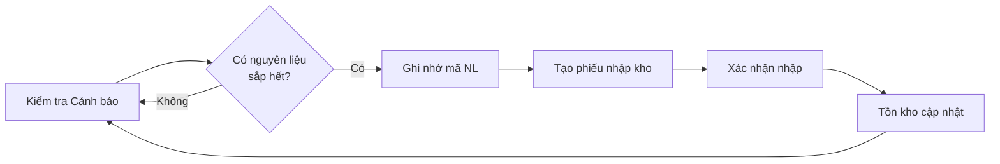
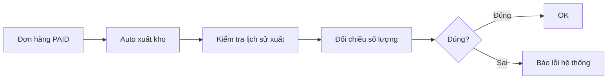

# 📦 HƯỚNG DẪN SỬ DỤNG QUẢN LÝ KHO

## 🎯 Tổng quan

Hệ thống Quản lý Kho giúp theo dõi nguyên liệu, lịch sử xuất/nhập kho, và cảnh báo tồn kho thấp.

## 🔐 Phân quyền

- **Manager** và **Admin**: Truy cập đầy đủ tất cả tính năng
- **Cashier/Kitchen**: Không có quyền truy cập

## 🚀 Truy cập

1. Đăng nhập với tài khoản **Manager** hoặc **Admin**
2. Vào trang **Manager Dashboard** (`/manager`)
3. Click nút **"📦 Quản lý Kho"** ở góc dưới bên trái
4. Hoặc truy cập trực tiếp: `http://localhost:5173/inventory`

## 📊 Các chức năng chính

### 1. 📊 Tồn kho (Stock)

**Mục đích:** Xem danh sách tất cả nguyên liệu với thông tin tồn kho hiện tại

**Các cột dữ liệu:**
- **Mã**: Mã nguyên liệu (VD: NL_CA_PHE_DEN)
- **Tên nguyên liệu**: Tên đầy đủ
- **Tồn kho**: Số lượng còn lại
- **Đơn vị**: kg, lít, gói, v.v.
- **Giá nhập**: Giá nhập gần nhất
- **Giá trị tồn**: Tổng giá trị = tồn kho × giá nhập

**Tính năng:**
- 🔍 Tìm kiếm theo tên hoặc mã nguyên liệu
- 🔄 Làm mới dữ liệu
- Sắp xếp theo tên

**Cách dùng:**
```
1. Nhập từ khóa vào ô "🔍 Tìm kiếm..."
2. Kết quả tự động lọc theo thời gian thực
3. Click "🔄 Làm mới" để cập nhật dữ liệu mới nhất
```

---

### 2. ⚠️ Cảnh báo (Warnings)

**Mục đích:** Theo dõi nguyên liệu sắp hết hoặc đã hết để kịp thời nhập thêm

**Trạng thái cảnh báo:**
- 🔴 **HẾT HÀNG**: Tồn kho = 0 hoặc rất thấp
- ⚠️ **SẮP HẾT**: Tồn kho dưới ngưỡng an toàn
- ✅ **ĐỦ**: Tồn kho ổn định

**Dashboard thống kê:**
- Tổng số nguyên liệu
- Số lượng hết hàng (màu đỏ)
- Số lượng sắp hết (màu vàng)
- Số lượng đủ hàng (màu xanh)

**Các cột dữ liệu:**
- **Trạng thái**: Badge màu hiển thị tình trạng
- **Mã, Tên nguyên liệu**
- **Tồn kho**: Số lượng hiện tại
- **Làm được (ly)**: Ước tính số ly có thể pha với tồn kho hiện tại
- **Giá trị**: Giá trị tồn kho

**Ưu tiên hiển thị:**
1. Hết hàng (đỏ) → hiển thị đầu tiên
2. Sắp hết (vàng)
3. Đủ hàng (xanh)

**Cách dùng:**
```
1. Vào tab "⚠️ Cảnh báo"
2. Kiểm tra các nguyên liệu màu đỏ/vàng
3. Ghi nhớ mã nguyên liệu cần nhập
4. Chuyển sang tab "📥 Lịch sử nhập" để tạo phiếu nhập kho
```

---

### 3. 📤 Lịch sử xuất (Export History)

**Mục đích:** Xem lịch sử xuất kho tự động khi đơn hàng được thanh toán

**Lưu ý:** Hệ thống tự động xuất kho khi đơn hàng chuyển sang trạng thái **PAID**. Không thể xuất kho thủ công.

**Các cột dữ liệu:**
- **Thời gian**: Ngày giờ xuất kho
- **Nguyên liệu**: Tên + mã
- **Số lượng**: Số lượng xuất (màu đỏ, dấu -)
- **Đơn hàng**: Link đến đơn hàng (ĐH #123)
- **Giá trị**: Giá trị xuất kho
- **Ghi chú**: Ghi chú tự động từ hệ thống

**Tính năng lọc:**
- 📅 **Từ ngày - Đến ngày**: Chọn khoảng thời gian
- 🔍 **Tìm kiếm**: Tìm theo tên nguyên liệu hoặc số đơn hàng
- 🔍 **Nút Lọc**: Áp dụng bộ lọc ngày

**Cách dùng:**
```
1. Chọn "Từ ngày" và "Đến ngày"
2. Click nút "🔍 Lọc"
3. Hoặc dùng ô tìm kiếm để tìm nhanh
4. Xem chi tiết đơn hàng liên quan
```

**Ví dụ:**
```
Thời gian: 27/10/2025 14:30
Nguyên liệu: Cà phê đen (NL_CA_PHE_DEN)
Số lượng: -0.05 kg
Đơn hàng: ĐH #156
Giá trị: 5,000đ
Ghi chú: Xuất tự động cho đơn #156
```

---

### 4. 📥 Lịch sử nhập (Import History)

**Mục đích:** Xem lịch sử nhập kho và tạo phiếu nhập kho mới

**Các cột dữ liệu:**
- **Thời gian**: Ngày giờ nhập kho
- **Nguyên liệu**: Tên + mã
- **Số lượng**: Số lượng nhập (màu xanh, dấu +)
- **Đơn giá**: Giá nhập/đơn vị
- **Thành tiền**: Tổng tiền = số lượng × đơn giá
- **Nhà cung cấp**: Tên nhà cung cấp
- **Ghi chú**: Ghi chú thêm

**Tính năng:**
- 📅 Lọc theo khoảng thời gian
- 🔍 Tìm kiếm theo nguyên liệu/NCC
- ➕ **Nhập kho mới**: Tạo phiếu nhập kho thủ công

---

### 📥 Tạo phiếu nhập kho mới

**Các bước thực hiện:**

#### Bước 1: Mở form nhập kho
```
1. Vào tab "📥 Lịch sử nhập"
2. Click nút "➕ Nhập kho" (màu xanh, góc trên phải)
3. Form popup hiện ra
```

#### Bước 2: Điền thông tin
```
┌─────────────────────────────────┐
│  📥 Nhập kho mới                │
├─────────────────────────────────┤
│ Nguyên liệu *                   │
│ [Dropdown chọn]                 │
│                                 │
│ Số lượng *                      │
│ [100]                           │
│                                 │
│ Đơn giá (VNĐ) *                 │
│ [50000]                         │
│                                 │
│ Nhà cung cấp                    │
│ [Công ty TNHH ABC]              │
│                                 │
│ Ghi chú                         │
│ [Nhập từ NCC mới...]            │
│                                 │
│ [Hủy]  [✅ Xác nhận nhập]       │
└─────────────────────────────────┘
```

**Trường bắt buộc (*):**
- Nguyên liệu
- Số lượng
- Đơn giá

**Trường tùy chọn:**
- Nhà cung cấp
- Ghi chú

#### Bước 3: Xác nhận
```
1. Kiểm tra lại thông tin
2. Click "✅ Xác nhận nhập"
3. Thông báo "✅ Nhập kho thành công!"
4. Form tự động đóng
5. Dữ liệu tự động cập nhật:
   - Tồn kho tăng lên
   - Lịch sử nhập có bản ghi mới
   - Giá nhập mới nhất được cập nhật
```

**Ví dụ thực tế:**
```
Nguyên liệu: Sữa tươi (NL_SUA_TUOI)
Số lượng: 20 (lít)
Đơn giá: 35,000đ/lít
Nhà cung cấp: Vinamilk
Ghi chú: Đợt nhập tháng 10

→ Thành tiền: 700,000đ
→ Tồn kho cũ: 5 lít
→ Tồn kho mới: 25 lít
```

---

## 🔧 Quy trình nghiệp vụ

### Quy trình 1: Theo dõi và nhập kho định kỳ



### Quy trình 2: Kiểm tra xuất kho cho đơn hàng



---

## 📱 Giao diện

### Desktop (>1024px)
- Header với nút quay lại
- 4 tabs ngang: Tồn kho | Cảnh báo | Lịch sử xuất | Lịch sử nhập
- Bảng dữ liệu full width
- Form popup modal

### Tablet (768px - 1024px)
- Tabs có thể xuống dòng
- Bảng có thanh cuộn ngang
- Form đầy đủ

### Mobile (<768px)
- Tabs dạng list
- Bảng responsive với scroll
- Form chiếm full màn hình

---

## 🎨 Màu sắc & Ý nghĩa

| Màu | Ý nghĩa | Sử dụng |
|-----|---------|---------|
| 🔵 Xanh dương | Tồn kho | Tab Stock, số lượng tồn |
| 🟠 Cam | Cảnh báo | Tab Warnings, trạng thái sắp hết |
| 🟣 Tím | Xuất kho | Tab Export History |
| 🟢 Xanh lá | Nhập kho | Tab Import History, số lượng nhập |
| 🔴 Đỏ | Hết hàng | Cảnh báo critical, số âm |
| ⚫ Xám | Trung tính | Nút Hủy, header |

---

## 🔔 Cảnh báo & Lưu ý

### ⚠️ Cảnh báo quan trọng

1. **Không xuất kho thủ công**: Hệ thống tự động xuất khi đơn PAID
2. **Giá nhập ảnh hưởng giá vốn**: Nhập giá chính xác để tính lợi nhuận đúng
3. **Kiểm tra trước khi nhập**: Xác nhận số lượng và đơn giá
4. **Backup dữ liệu**: Xuất báo cáo định kỳ

### 💡 Tips & Tricks

1. **Tìm kiếm nhanh**: Gõ mã nguyên liệu thay vì tên đầy đủ
2. **Lọc theo ngày**: Dùng bộ lọc để xem xu hướng tiêu thụ
3. **Kiểm tra cảnh báo hàng ngày**: Tránh hết hàng đột ngột
4. **Ghi chú chi tiết**: Giúp truy vết nguồn gốc khi có vấn đề

---

## 🐛 Xử lý lỗi thường gặp

### Lỗi 1: "Không tải được dữ liệu"
**Nguyên nhân:** Backend chưa chạy hoặc mất kết nối
**Giải pháp:**
```bash
# Kiểm tra backend đang chạy
cd backend
npm start
```

### Lỗi 2: "Nhập kho thất bại"
**Nguyên nhân:** Thiếu thông tin bắt buộc hoặc format sai
**Giải pháp:**
- Kiểm tra đã chọn nguyên liệu
- Số lượng và đơn giá phải > 0
- Không nhập ký tự đặc biệt

### Lỗi 3: "Không có quyền truy cập"
**Nguyên nhân:** Tài khoản không phải Manager/Admin
**Giải pháp:**
- Đăng nhập lại với tài khoản Manager
- Hoặc liên hệ Admin để cấp quyền

---

## 📞 Liên hệ hỗ trợ

- **Technical Support**: [Your Email]
- **Documentation**: `/docs/inventory`
- **Issue Tracker**: GitHub Issues

---

## 📝 Changelog

### Version 1.0.0 (27/10/2025)
- ✅ Xem tồn kho nguyên liệu
- ✅ Cảnh báo hết hàng/sắp hết
- ✅ Lịch sử xuất kho tự động
- ✅ Lịch sử nhập kho
- ✅ Nhập kho thủ công
- ✅ Tìm kiếm và lọc dữ liệu
- ✅ Responsive design
- ✅ Phân quyền Manager/Admin

### Kế hoạch phát triển (Roadmap)
- [ ] Export báo cáo Excel/PDF
- [ ] Biểu đồ xu hướng tiêu thụ
- [ ] Cảnh báo qua email/SMS
- [ ] Quét mã vạch nguyên liệu
- [ ] Tích hợp nhà cung cấp
- [ ] Dự báo nhu cầu nhập kho

---

## 🎓 Đào tạo

### Video hướng dẫn (Coming soon)
1. Tổng quan hệ thống Quản lý Kho
2. Cách tạo phiếu nhập kho
3. Đọc và phân tích cảnh báo
4. Đối chiếu xuất kho với đơn hàng

### Tài liệu bổ sung
- `DATABASE_SCHEMA.md`: Cấu trúc bảng nguyên liệu
- `API_ENDPOINTS.md`: Chi tiết các API inventory
- `BACKUP_RESTORE.md`: Sao lưu và khôi phục dữ liệu

---

**© 2025 Coffee Shop Management System**
